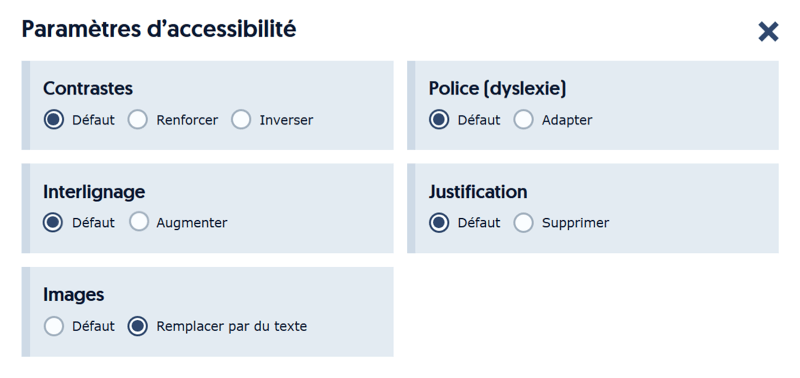
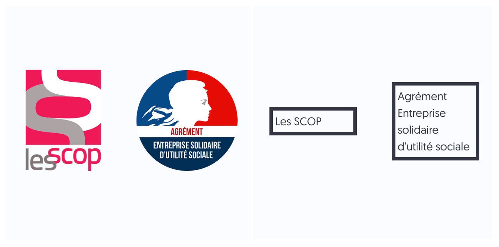

import IconedLink from '@site/src/components/IconedLink';
import { CriteriaA } from '@site/src/components/CriteriaTag';
import SlidesLink from "@site/src/components/SlidesLink";
import { BookmarkletTags } from '@site/src/components/ToolsLinks';

# 1.3 Pour chaque image [porteuse d’information](https://accessibilite.numerique.gouv.fr/methode/glossaire/#image-porteuse-d-information) ayant une [alternative textuelle](https://accessibilite.numerique.gouv.fr/methode/glossaire/#alternative-textuelle-image), cette alternative est-elle pertinente (hors cas particuliers) ?
<CriteriaA />
<IconedLink>[Lien RGAA](https://accessibilite.numerique.gouv.fr/methode/criteres-et-tests/#1.3)</IconedLink>
<BookmarkletTags names={["List images"]} />
<SlidesLink page={45} />

## Comment le tester ?

- Lancer le BM `List images`.
- Repérer les images porteuses d'information parmi les éléments entourés.
- Vérifier la <u>**pertinence**</u> des alternatives textuelles.
- L'alternative doit être <u>**courte et concise**</u>.

:::note

Les cas hors scope sont :
- les images CAPTCHA (traitées dans le [critère 1.4](./1.4))
- les images avec beaucoup d'informations : il vaudra mieux mettre une description attachée (traitée dans le [critère 1.6](./1.6))

:::

## Exemple de mécanisme de remplacement

[AccessConfig](https://accessconfig.a11y.fr/) propose un mécanisme de remplacement
des textes en image porteurs d’information par leur alternative textuelle.

Sur le site d’[Access42](https://access42.net/), les textes en images porteurs d’information
peuvent être remplacés par leur alternative textuelle.

## Résumé des tests

Récupérer l'alternative tel que défini dans le [critère 1.1](./1.1) et vérifier **sa pertinence au vu du contexte dans la page**

## Cas particuliers

Il existe une gestion de cas particuliers lorsque l’image est utilisée comme [CAPTCHA](https://accessibilite.numerique.gouv.fr/methode/glossaire/#captcha)
ou comme [image-test](https://accessibilite.numerique.gouv.fr/methode/glossaire/#image-test).
Dans cette situation, où il n’est pas possible de donner une alternative pertinente sans détruire
l’objet du CAPTCHA ou du test, le critère est non applicable.

Note : le cas des CAPTCHA et des images-test est traité de manière spécifique par le [critère 1.4](./1.4).

## Références

### WCAG 2.1

#### Critère(s) de succès :
*   [1.1.1 (A)](https://www.w3.org/Translations/WCAG21-fr/#non-text-content "critère 1.1.1 (A) - nouvelle fenêtre")
*   [4.1.2 (A)](https://www.w3.org/Translations/WCAG21-fr/#name-role-value "critère 4.1.2 (A) - nouvelle fenêtre")

#### Technique(s) suffisante(s) et/ou échec(s) (en anglais) :
*   [G94](https://www.w3.org/WAI/WCAG21/Techniques/general/G94 "G94 - nouvelle fenêtre")
*   [G95](https://www.w3.org/WAI/WCAG21/Techniques/general/G95 "G95 - nouvelle fenêtre")
*   [F30](https://www.w3.org/WAI/WCAG21/Techniques/failures/F30 "F30 - nouvelle fenêtre")
*   [F71](https://www.w3.org/WAI/WCAG21/Techniques/failures/F71 "F71 - nouvelle fenêtre")
*   [G196](https://www.w3.org/WAI/WCAG21/Techniques/general/G196 "G196 - nouvelle fenêtre")
*   [ARIA6](https://www.w3.org/WAI/WCAG21/Techniques/aria/ARIA6 "ARIA6 - nouvelle fenêtre")
*   [ARIA9](https://www.w3.org/WAI/WCAG21/Techniques/aria/ARIA9 "ARIA9 - nouvelle fenêtre")
*   [ARIA10](https://www.w3.org/WAI/WCAG21/Techniques/aria/ARIA10 "ARIA10 - nouvelle fenêtre")

### EN 301 549 V2.1.2 (2018-08) (en anglais)
*   9.1.1.1 Non-text Content (A)
*   9.4.1.2 Name, Role, Value (A)